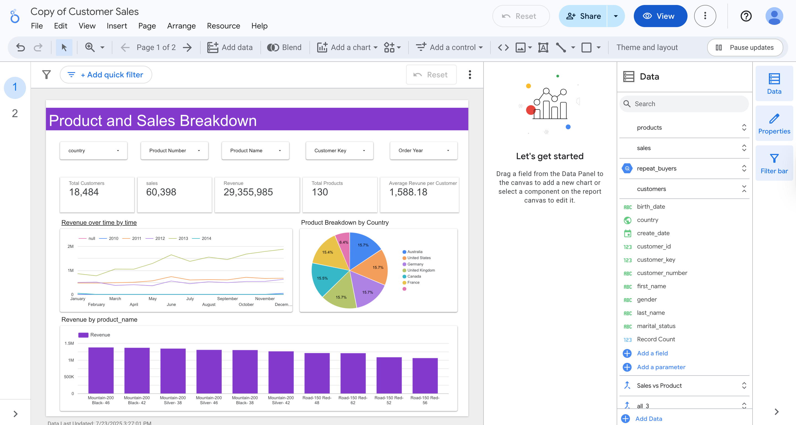
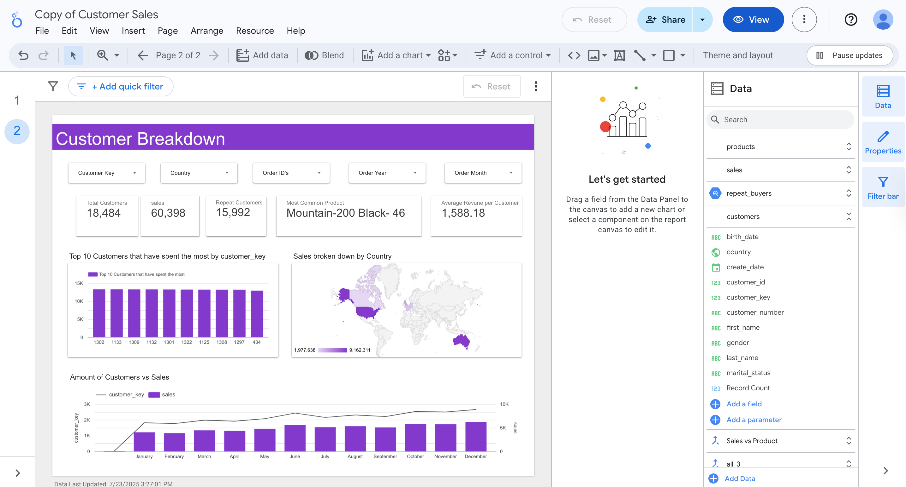

# Customer Service Sales Dashboards – Looker Studio, SQL & Python

This project analyzes customer purchasing behavior using transactional sales data. It combines SQL and Python analysis with a visual dashboard in Google Looker Studio. The goal is to answer key business questions about customer segments, product performance, and buying trends.

---

## Project Components

- **Looker Studio Dashboards**: Visual overview of sales performance and customer behavior
- **SQL Analysis**: Answers business questions using structured queries
- **Python Analysis**: Mirrors SQL logic using pandas for deeper data wrangling and visualization

---

## Dashboards Overview 
https://lookerstudio.google.com/reporting/0fa75936-66b1-4874-870b-a6129cfee1f7

### 1. Product and Sales Breakdown
- **KPIs**: Total Revenue, Total Sales, Avg Revenue per Customer
- **Charts**: Revenue over time, Revenue per product, Product breakdown by country

### 2. Customer Breakdown
- **KPIs**: Total Customers and Most Common Product
- **Charts**: Top customers by spend, Location map, Monthly sales trend

---

## Data Sources

- `sales.csv`: Transactional sales data (`order_date`, `sales`, `price`, `quantity`)
- `customers.csv`: Customer demographics (`country`, `gender`, `marital_status`)
- `products.csv`: Product master data (`product_key`, `product_name`)

---

## Key Features

- **Data Cleaning**: Removed inaccurate rows where `quantity * price ≠ sales`
- **Repeat Customer Identification**: Based on order frequency
- **Calculated Metrics**: AOV, product pairs, lead time, monthly trends
- **Dual implementation**: SQL + Python for cross-validation

---

## Screenshots

  
  

---

## Tools Used

- Google Looker Studio
- SQL (MySQL-style syntax)
- Python (pandas, itertools, collections)

---

## Folders

| Folder      | Description                                |
|-------------|--------------------------------------------|
| `sql/`      | SQL queries and logic with explanations    |
| `python/`   | Python analysis and insights               |
| `screenshots/` | Store dashboard images |

---
